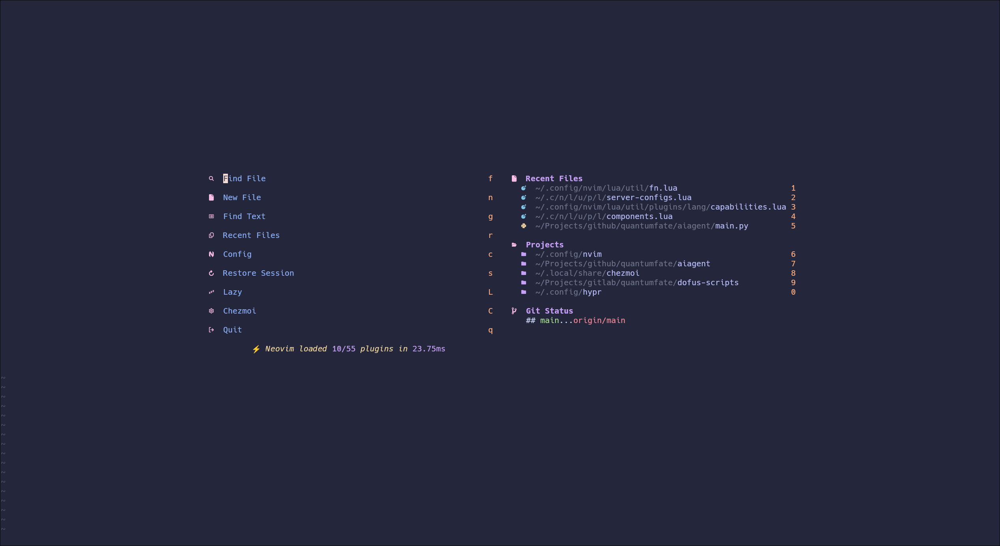

# My neovim config

## Minimum effort lazy loading

## Debugging

## Dependencies

- neovim > v0.11
- fzf
- git
- go
- rustup
- nodejs
- npm
- python
- ripgrep
- devpod

## Remarks

- very inspired by [LazyVim](https://www.lazyvim.org/)
